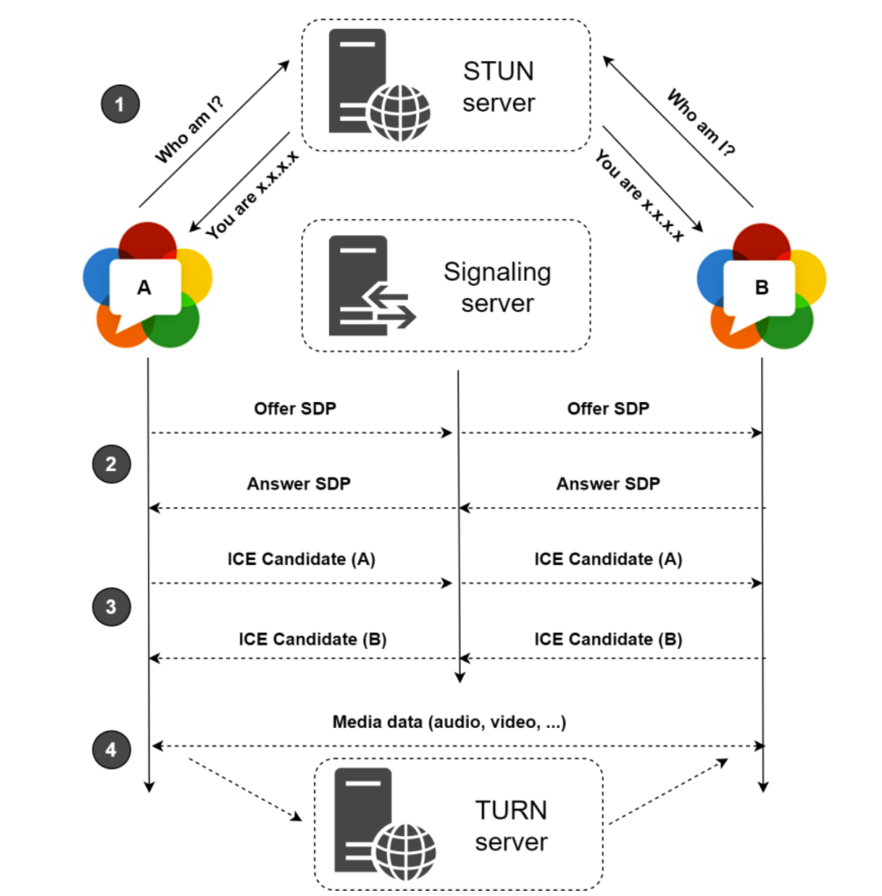

# WEB RTC

### WEB RTC 란?

- 구글에서 발명한 웹 브라우저 간 플러그인의 도움없이 서로 통신할 수 있도록 설계된 API
- 데이터를 서버를 통하지 않고 유저들끼리 직접 주고 받게 하기 때문에 서비스하는데 서버 자원이 많이 소모되지 않음
- 흔히 웹 통신에 쓰이는 TCP가 아닌 UDP 프로토콜을 사용하여 빠른 실시간 음성/영상 데이터 전송가능
- 파이어폭스, 엣지, 사파리 등도 버전에 따라 지원하고 있으나 기본적으로 크롬에 최적화
- 공식 홈페이지 :[https://webrtc.org/?hl=ko](https://webrtc.org/?hl=ko)

### 동작 원리

</img>
1. 유저 A , 유저 B 가 STUN 서버를 통해서 자신의 주소를 알아낸다
2. Signaling 서버를 통해 유저 A 가 유저 B 에게 Offer SDP(Session Description Protocol)를 주면 유저 B는 다시 Answer SDP를 보내준다.  (SDP [http://www.ktword.co.kr/test/view/view.php?m_temp1=2114](http://www.ktword.co.kr/test/view/view.php?m_temp1=2114))
3. Signaling 서버를 통해 유저 A,B가 서로 ICE Candidate ( 일종의 주소 목록)을 주고 받는다.
4. 만약 방화벽 등의 이유로 두 유저가 직접적으로 데이터를 주고 받을 수 없을 시  TURN 서버를 통하여 데이터를 중계한다. (이 경우 서버가 직접 데이터를 교환시키는 것이므로 서버 자원을 소모한다.)

### WER RTC API Function

1. 나의 카메라와 마이크로 부터 데이터 가져오기
- 함수 실행시 stream 을 반환하는데 이 stream을 video테그 에 부여하면 나의 카메라가 찍고 있는 화면을 확인 가능
```
navigator.getUserMedia({
  video: {
  //옵션
  frameRate: 24,
  width: {
  min: 480, ideal: 720, max: 1280
  },
  aspectRatio: 1
  },
  audio: true
}, (stream) => {
  localStream = stream;
  document.getElementById("my-video").srcObject = localStream;
}, (error) => {
  console.log(error);
})
```

2. stun server 와 turn server 정보 등록 ( stun 서버는 구글 오픈 서버 이용가능 )
```
let configuration = {
  iceServers: [
    {
    "urls": ["stun:stun.l.google.com:19302",
    "stun:stun1.l.google.com:19302",
    "stun:stun2.l.google.com:19302"]
    },
    // {
    //   'urls': 'turn:ip:port?transport=udp',
    //   'credential': 'XXXXXXXXXXXXX',
    //   'username': 'XXXXXXXXXXXXXXX'
    // },
    // {
    //   'urls': 'turn:ip:port?transport=tcp',
    //   'credential': 'XXXXXXXXXXXXX',
    //   'username': 'XXXXXXXXXXXXXXX'
    // }
    // https://github.com/coturn/coturn
    // turn 서버 추가
  ]
}
```
3. 2의 configuration으로 peerConn 생성후 1의 localStream을 등록
```
let peerConn = new RTCPeerConnection(configuration);
peerConn.addStream(localStream);
```
4. stun server로 부터 ICE candidate를 받은 후 Signaling 서버를 통해 상대방에게 전달
```
peerConn.onicecandidate = ((e) => {
  if (e.candidate == null){return}
  // 상대방에게 보내는 코드
})
```
5. offer를 생성하고 나의 localDescription에 등록 후 상대방에게 전달 
```
peerConn.createAnswer((answer) => {
  peerConn.setLocalDescription(answer);
  //상대방에게 보내는 코드
}, error => {
  console.log(error);
})
```
6. answer를 생성하고 나의 localDescription에 등록 후 상대방에게 전달 
```
peerConn.createAnswer((answer) => {
  peerConn.setLocalDescription(answer);
  //상대방에게 보내는 코드
}, error => {
  console.log(error);
})
```
7. 5,6에서 전달받은 answer/offer sdp 를 remoteDescription에 등록
```
peerConn.setRemoteDescription(sdp);
```
8. 4에서 전달받은 candidate를 등록
```
peerConn.addIceCandidate(candidate);
```
9. connect된 후 상대방의 stream이 생성된 후 video테그에 등록
```
peerConn.onaddstream = (e) => {
  document.getElementById("remoteVideo").srcObject = e.stream;
}
```

### Signaling Server
+ 실시간으로 sdp,candidate를 주고 받아야 하기 때문에 websocket을 이용
+ Spring Boot / Stomp / SockJS 사용
+ 실행
```
docker build .
docker compose up -d
docker exec -it webrtc-webrtc-1 bash
./gradlew init
./gradlew build
 => ./build/libs 안에 war 파일 생성
java -jar ./build/libs/signaling-0.0.1-SNAPSHOT.war
 => 브라우저에 localhost:8088 입력
```


### 발생했던 에러 상황
+ webRTC의 모든 함수는 비동기로 동작하기 때문에 localStream이 생성되기전에 addStream 함수가 호출 된 경우가 가끔씩 있음 (보통은 localStream 생성이 더빠름)
+ candidate를 remoteDescription 등록 전에 등록하려고 하면 에러발생
+ localhost 가 아니고 공개된 site에서 사용할 때 ssl보안이 되어있지 않으면 api를 지원하지 않음

